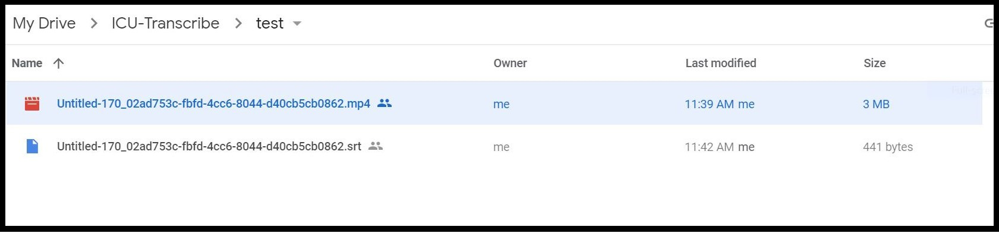

# DriveCaption
Work flow:

Select the caption profile in mediasite:

MP4 will show up in google drive folder:

After captioning is done place SRT file back in drive with the same name

Captions will get uploaded to server.  The MP4 and caption files are moved to another drive folder.

* Requires linux box setup with sftp enabled.  
* Node.js needs to be installed on the machine
* Account for the mediasite transcription profile needs to be setup on the linux box
* Account to use Mediasite API needs to be setup
* API for google drive needs to be setup. https://developers.google.com/drive/api/v3/about-auth
* Run this command under the user account `“node <install location>/bin/interval.js”`.  Node PM2 can be used to set it up as a service instead.
